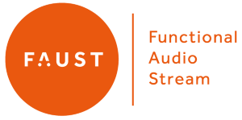
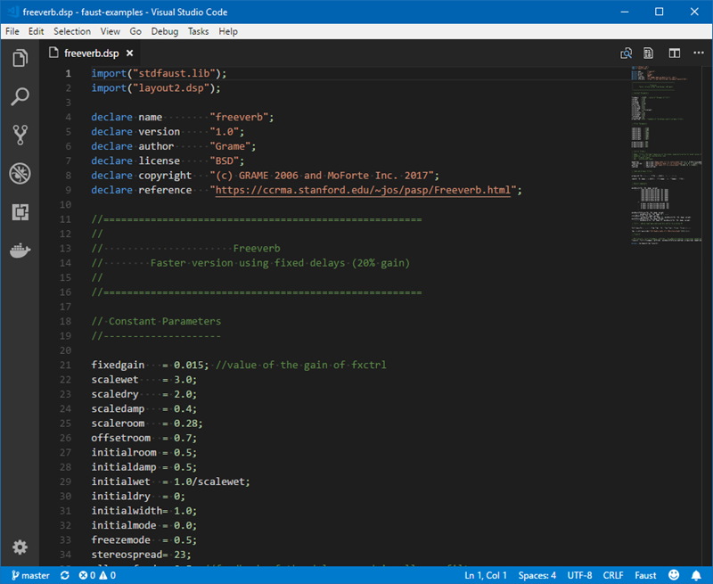

# Faust Support for Visual Studio Code

This is a simple extension that provides syntax highlighting of [Faust](http://faust.grame.fr/) source files as well as snippets for the core language and built-in libraries.

## Features

* Syntax highlighting of the [Faust programming language](http://faust.grame.fr/Documentation/)
* Snippets support for the core language and default libraries.

## Requirements

* [Faust 2.5](https://github.com/grame-cncm/faust/releases) or greater

## Acknowlegements

* The language grammar and snippets were derived in part from the [atom syntax highlighting plugin for Faust](https://github.com/grame-cncm/faust/tree/master-dev/syntax-highlighting/atom/language-faust) and released under [this license](https://github.com/grame-cncm/faust/blob/master-dev/syntax-highlighting/atom/language-faust/LICENSE.md). Thanks to Yann Orlarey ([@lrlarey](https://github.com/orlarey)) and other contributors for their work!
